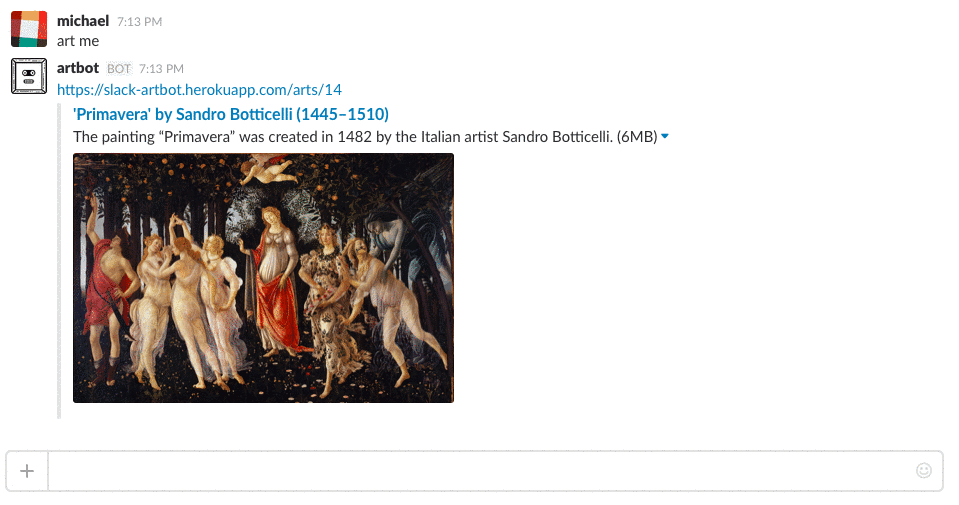

# Rails & Slack Art-Bot

[Heroku App](https://slack-artbot.herokuapp.com/)

[@SlackArtbot](https://twitter.com/slackartbot) Twitter

##What is Artbot?
Artbot is a Rails application hosting a [Slack chatbot integration](https://api.slack.com/bot-users) written in Ruby that can serve information on-demand from its database about artists, art pieces and deliver quizzes.

##Features

###Rails App
* CRUD-able database
* User login	
* Responsive design 
* Meta tags optimized to display more information for Slack, Twitter, and Facebook

###Bot
* Slack integration
* Real Time Messaging
* Listens for commands in slack and requests data from server asynchronously
* Responds with preconfigured messages

##Technologies
`Ruby 2.2.1`
`Rails 4.2.6`
`PostgreSQL`
`HTML/CSS/SASS`
`Bootstrap-SASS`

###Websockets
`faye-websocket`
`thin`
`eventmachine`

###Additional
`devise`
`http`
`json`

###Development/Testing
`rspec`
`pry-byebug`
`shoulda-matchers`
`factory_girl_rails`

## Planned Features
* More bot commands
* Slack button integration
* Upgrading to an App Bot
* Accepts multiple possible answers during quiz.
* Multiple choice quiz
* Track correct answers per user 

## Contributors
* [Anna Schwab](https://github.com/cloverharvest)
* [Morgan Sharif](https://github.com/morgansharif)
* [Michael Silverberg](https://github.com/mbd-s)
* [Justin Tam](https://github.com/jtam11)